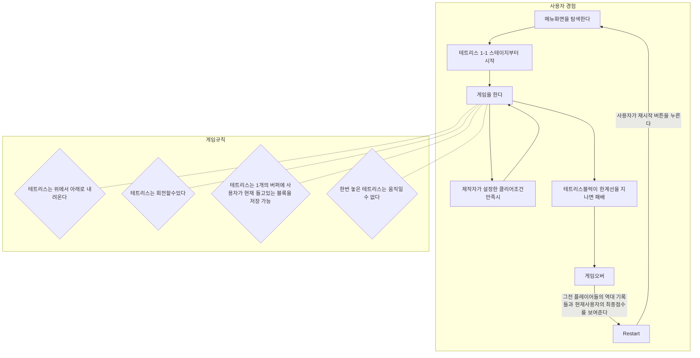

DesignDiagram

```mermaid
graph TD
  subgraph GameFlow[사용자 경험]
    Menu -->  GameStart[테트리스 1-1 스테이지부터 시작]
    
    
    GameStart --> Play[게임을 한다]
    Play --> Clear[제작자가 설정한 클리어조건만족시]
    Clear--> Play
    Play --> LoseCondition[테트리스블럭이 한계선을 지나면 패배]
    LoseCondition --> GameOver
    GameOver[게임오버] -->|그전 플레이어들의 역대 기록들과 현재사용자의 최종점수를 보여준다| Restart 
    Restart -->|사용자가 재시작 버튼을 누른다| Menu[메뉴화면을 탐색한다]
    
  end
  subgraph GameRule[게임규칙]
    
  Play -.- Rule1{테트리스는 위에서 아래로 내려온다}
  Play -.- Rule2{테트리스는 회전할수있다}
  Play -.- Rule3{테트리스는 1개의 버퍼에 사용자가 현재 들고있는 블록을 저장 가능}
  Play -.- Rule4{한번 놓은 테트리스는 움직일 수 없다}
end
  
```
RuntimeDiagram

```mermaid
graph TD
  A --> B
```
ClassDiagram
```mermaid

```
