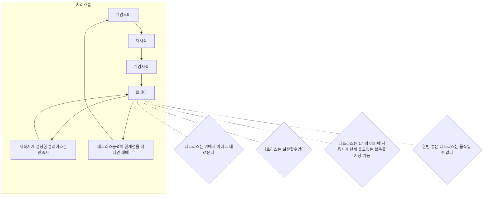

DesignDiagram

```mermaid
graph TD
  subgraph GameFlow[처리흐름]
    GameOver[게임오버] --> Restart[재시작]
    Restart --> GameStart[게임시작]
    GameStart --> Play[플레이]
    Play --> Clear[제작자가 설정한 클리어조건만족시]
    Clear--> Play
    Play --> LoseCondition[테트리스블럭이 한계선을 지나면 패배]
    LoseCondition --> GameOver
  end
  Play -.- Rule1{테트리스는 위에서 아래로 내려온다}
  Play -.- Rule2{테트리스는 회전할수있다}
  Play -.- Rule3{테트리스는 1개의 버퍼에 사용자가 현재 들고있는 블록을 저장 가능}
  Play -.- Rule4{한번 놓은 테트리스는 움직일 수 없다}

  
```
RuntimeDiagram

```mermaid
graph TD
  A --> B
```
ClassDiagram
```mermaid

```
