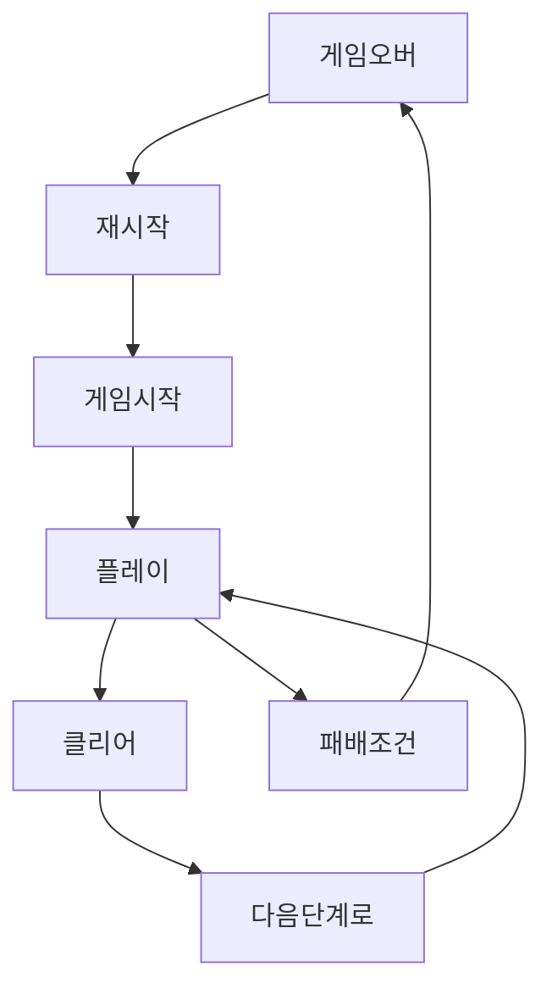

DesignDiagram

```mermaid
graph TD
  GameOver[게임오버] --> Restart[재시작]
  Restart --> GameStart[게임시작]
  GameStart --> Play[플레이]
  Play --> Clear[클리어]
  Clear --> Head2HigherLevel[다음단계로]
  Head2HigherLevel --> Play
  Play --> LoseCondition[패배조건]
  LoseCondition --> GameOver
```
RuntimeDiagram

```mermaid
graph TD
  A --> B
```
ClassDiagram
```mermaid

```
