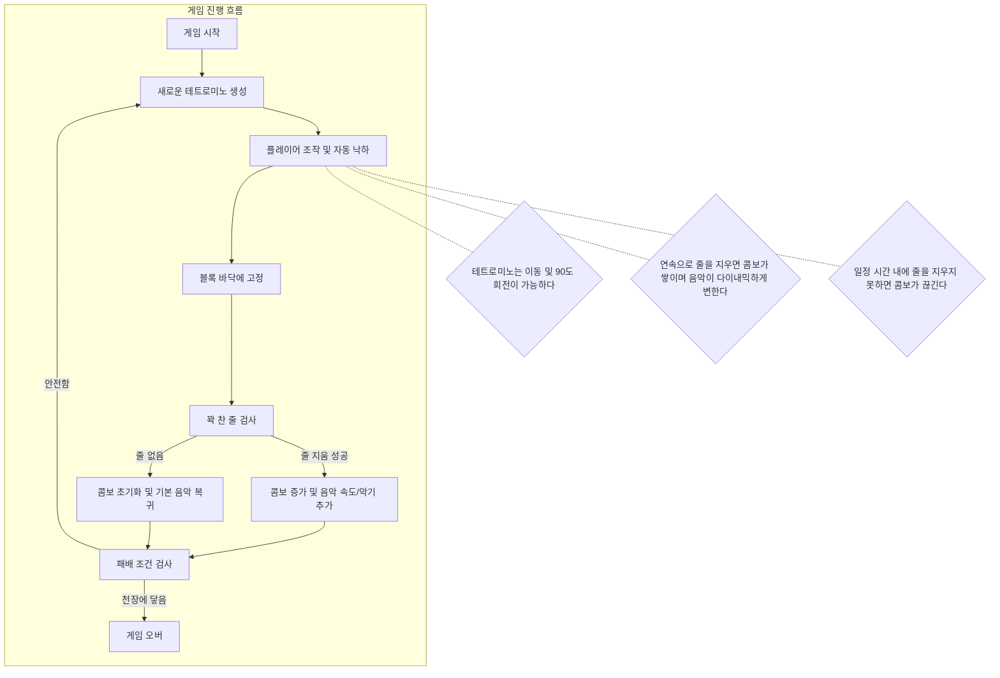
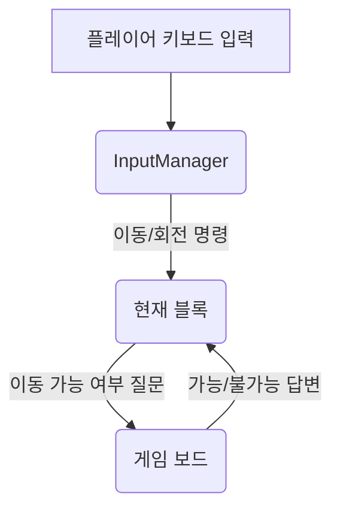
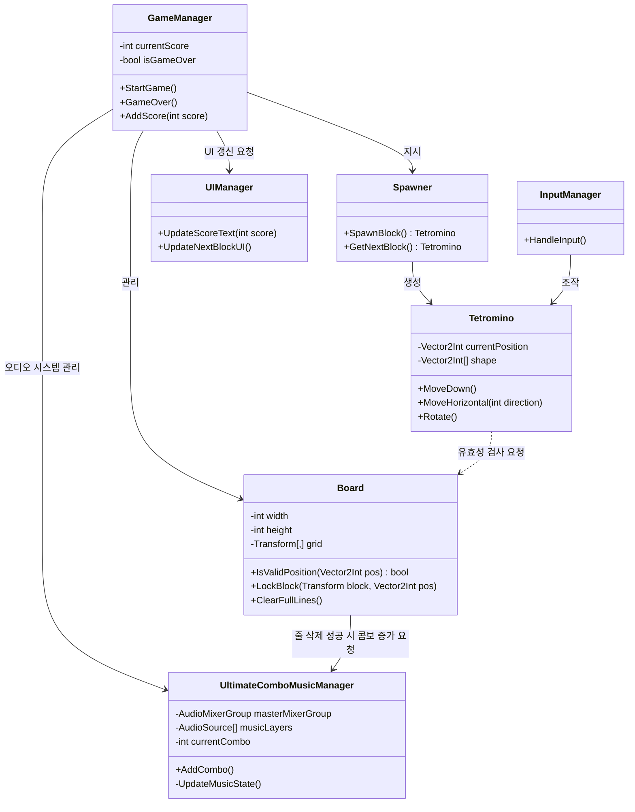

### DesignDiagram

```mermaid
graph TD
  subgraph GameFlow[게임 진행 흐름]
    GameStart[게임 시작] --> Spawn[새로운 테트로미노 생성]
    Spawn --> Play[플레이어 조작 및 자동 낙하]
    Play --> Lock[블록 바닥에 고정]
    Lock --> CheckLine[꽉 찬 줄 검사]
    CheckLine -->|줄 지움 성공| Combo[콤보 증가 및 음악 속도/악기 추가]
    CheckLine -->|줄 없음| ResetCombo[콤보 초기화 및 기본 음악 복귀]
    Combo --> CheckFail[패배 조건 검사]
    ResetCombo --> CheckFail
    CheckFail -->|천장에 닿음| GameOver[게임 오버]
    CheckFail -->|안전함| Spawn
  end

  Play -.- Rule1{테트로미노는 이동 및 90도 회전이 가능하다}
  Play -.- Rule2{연속으로 줄을 지우면 콤보가 쌓이며 음악이 다이내믹하게 변한다}
  Play -.- Rule3{일정 시간 내에 줄을 지우지 못하면 콤보가 끊긴다}
```

### RuntimeDiagram

```mermaid
graph TD
  User[플레이어 키보드 입력] --> Input(InputManager)
  Input -->|이동/회전 명령| Tetromino(현재 블록)
  Tetromino -->|이동 가능 여부 질문| Board(게임 보드)
  Board -->|가능/불가능 답변| Tetromino
```

### ClassDiagram

```mermaid
classDiagram
    class GameManager {
        -int currentScore
        -bool isGameOver
        +StartGame()
        +GameOver()
        +AddScore(int score)
    }

    class Board {
        -int width
        -int height
        -Transform[,] grid
        +IsValidPosition(Vector2Int pos) bool
        +LockBlock(Transform block, Vector2Int pos)
        +ClearFullLines()
    }

    class Tetromino {
        -Vector2Int currentPosition
        -Vector2Int[] shape
        +MoveDown()
        +MoveHorizontal(int direction)
        +Rotate()
    }

    class Spawner {
        +SpawnBlock() Tetromino
        +GetNextBlock() Tetromino
    }

    class InputManager {
        +HandleInput()
    }

    class UIManager {
        +UpdateScoreText(int score)
        +UpdateNextBlockUI()
    }

    class UltimateComboMusicManager {
        -AudioMixerGroup masterMixerGroup
        -AudioSource[] musicLayers
        -int currentCombo
        +AddCombo()
        -UpdateMusicState()
    }

    GameManager --> Board : 관리
    GameManager --> Spawner : 지시
    GameManager --> UIManager : UI 갱신 요청
    GameManager --> UltimateComboMusicManager : 오디오 시스템 관리
    Spawner --> Tetromino : 생성
    InputManager --> Tetromino : 조작
    Tetromino ..> Board : 유효성 검사 요청
    Board --> UltimateComboMusicManager : 줄 삭제 성공 시 콤보 증가 요청
```